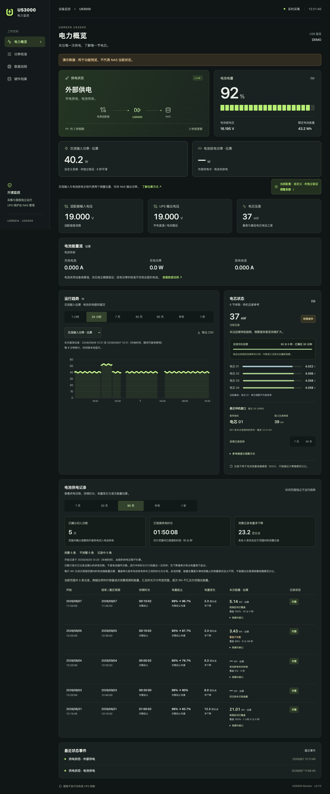

# US3000 Power Monitor

[简体中文](README.md) · **English**

<p align="center"></p>



*The preview uses DEMO data, with no real NAS telemetry or serial numbers. The UI and detailed documentation are primarily in Simplified Chinese.*

A UGREEN US3000 dashboard for power state, battery charge, cell voltages, and historical trends. A host collector uses Linux usbmon to observe existing UPS-driver traffic without writing to the UPS. Docker Compose runs the web dashboard.

**The NAS's existing UPS service remains responsible for power-loss protection and shutdown.** This community monitoring project is not affiliated with or certified by UGREEN.

## Features

- External power, charging, and battery power states.
- Charge percentage, input/output voltage, pack voltage, four cell voltages, and cell voltage difference.
- History charts, power and connection events, and CSV export.
- Hardware references, NUT status, and capture diagnostics.

Power fields still have protocol and measurement-location limitations. The optional empirical model is disabled by default (calibration profile `none`), so coefficients from the development unit are not applied. See [power calibration](docs/calibration.md).

## Prerequisites

- A Linux NAS connected to the UPS, with systemd, Python 3.10+, Git, Docker, and Compose v2.
- A kernel with usbmon support and working `/dev/usbmonN` devices.
- An existing NUT/system UPS driver connected to the US3000 and continuously reading complete private `0x71` reports.

Images support `linux/amd64` and `linux/arm64`. Real hardware validation covers one x86_64 NAS and US3000; ARM validation covers container operation only.

The dashboard and API have no built-in authentication. Use them only on a trusted LAN.

## Install

On the **Linux NAS connected to the UPS**, choose a directory on persistent storage and run:

```sh
git clone https://github.com/BSakura-Miku/ugreen-ups-panel.git
cd ugreen-ups-panel
sudo sh scripts/install-collector.sh && docker compose up -d
```

The installer sets up the host collector and prepares the data directory. Compose automatically pulls the [Docker Hub image](https://hub.docker.com/r/bsakuramiku/ugreen-ups-panel); no local build is required.

Open `http://NAS_IP:9086`, replacing `NAS_IP` with your NAS's LAN address.

Install the collector once. Routine dashboard updates do not require reinstalling it.

## Update

Run from the project directory:

```sh
docker compose pull && docker compose up -d
```

The default image is `bsakuramiku/ugreen-ups-panel:latest`. Check [release notes](https://github.com/BSakura-Miku/ugreen-ups-panel/releases) for changes. Update the collector scripts and reinstall only when the notes require it.

## Configuration and data

- The default port is `9086`. To change the port or image version, edit `docker-compose.yaml`, then run `docker compose up -d`.
- Compose automatically reads `docker-compose.yaml`; the top-level `name` field is optional. By default, the project name comes from the deployment directory, so the steps above use `ugreen-ups-panel`.
- History lives in `./data/history.sqlite` under the project directory and survives container recreation. Keep and back up the `data` directory.
- The container reads host snapshots through a read-only mount. The collector runs alongside the existing UPS service.

See [architecture](docs/architecture.md) for data flow, history storage, and backup details.

## If there is no data

Check the collector and dashboard logs:

```sh
journalctl -u ugreen-ups-collector.service -n 50 --no-pager
docker compose logs --tail 50
```

NUT displaying a charge percentage does not prove that the driver reads the complete reports this dashboard needs. See [validation scope](docs/validation.md) for requirements and known limitations.

## More documentation

- [Architecture and data flow](docs/architecture.md) · [Protocol fields](docs/fields.md) · [Power calibration](docs/calibration.md)
- [Hardware reference](docs/hardware.md) · [Validation scope](docs/validation.md) · [Changelog](CHANGELOG.md)
- [Development and contributing](CONTRIBUTING.md) · [Security](SECURITY.md)

## References and acknowledgments

Thanks to [cktk/ugreen-ups](https://github.com/cktk/ugreen-ups) for sharing its US3000 USB HID protocol research and telemetry field documentation, which provided the starting point for this project's protocol investigation. Field decoding was then checked against captures from a DXP4800 Plus and US3000.

The host capture interface follows the [Linux usbmon documentation](https://docs.kernel.org/usb/usbmon.html).

## License

Original source code uses the [MIT License](LICENSE). Third-party dependencies retain their own terms; see [THIRD_PARTY_NOTICES.txt](THIRD_PARTY_NOTICES.txt). Product names, trademarks, and third-party media belong to their respective owners.
