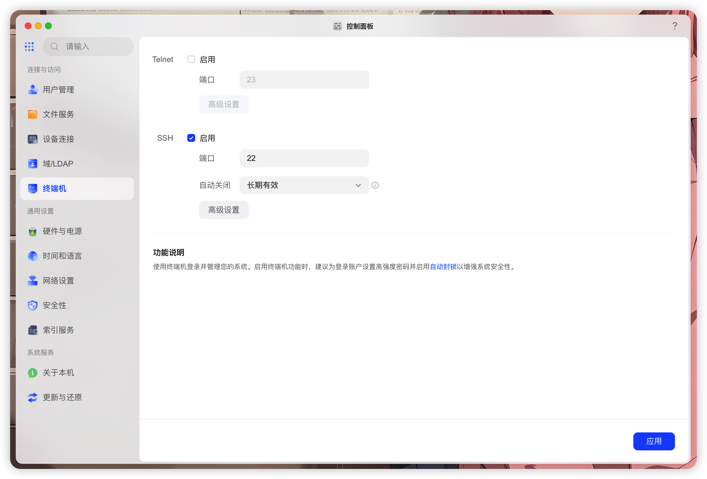
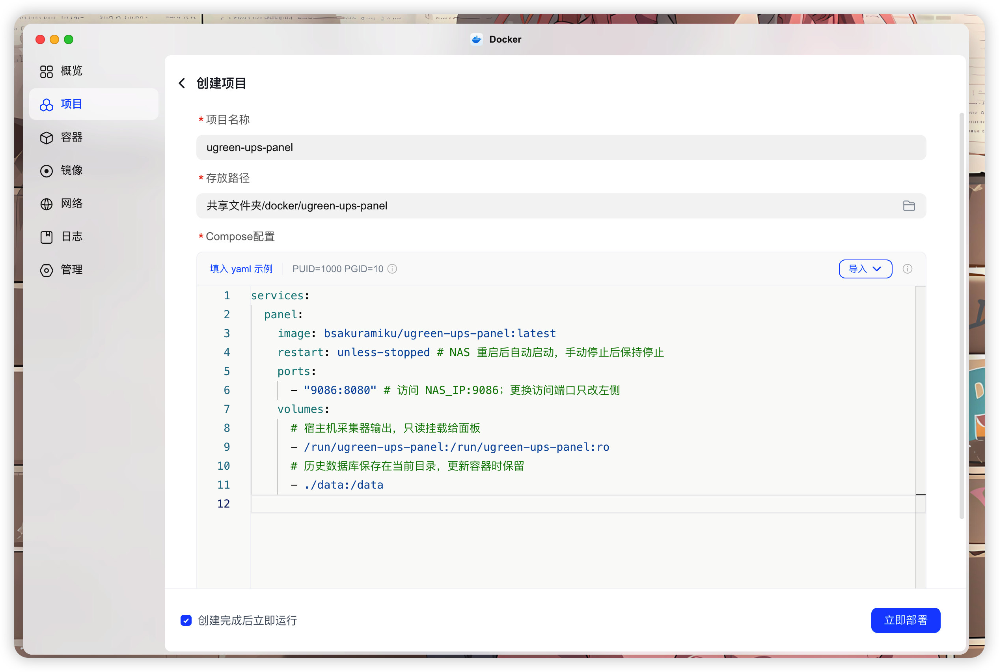

# US3000 电力监控

**简体中文** · [English](README.en.md)

<p align="center"></p>


*预览使用 DEMO 演示数据，不包含实际 NAS 数据或序列号。*

为 UGREEN US3000 提供供电状态、电量、电芯电压与历史趋势。宿主机采集器通过 Linux usbmon 只读观察已有 UPS 驱动的数据，Docker Compose 启动网页面板。

**NAS 原有 UPS 服务继续负责断电保护与关机。** 本项目是社区监控工具，与 UGREEN 无隶属或认证关系。

## 功能

- 查看外部供电、充电与电池供电状态。
- 查看电量、输入/输出电压、电池组与四节电芯电压、电芯压差。
- 查看最长一年的历史趋势、供电与连接事件，导出含均值和极值的 CSV。
- 对照电芯压差的均值与峰值，查看实际记录的日期跨度。
- 查看每次电池供电的起止时间、观测时长、起止电量，以及次数和电量净下降。
- 用手工交流读数分步校准，或直接查看、调整功率系数；支持确认 12/19/20 V 适配器输入。
- 查看硬件资料、NUT 状态与采集诊断。

趋势可选 1 小时、24 小时、7 天、30 天、90 天、半年（180 天）和一年（365 天）。超过 90 天使用按日统计；图表保留完整所选时间范围，尚未采集或中断的部分留空，已有几天数据就只显示几天。

电池供电明细从首次启用 v0.5.0 或更新版本后的有效采样开始记录，旧事件和聚合历史不会被补成明细。默认查看 90 天，可选 7 天至一年；缺少起止或采集中断的记录会标为不完整。电量净下降以百分点计，允许出现电量回升，不是耗电瓦时或电池循环次数。

功率相关字段仍有协议解释和测点限制；可选经验模型默认关闭（校准配置 `none`），不套用开发样机系数，详见[功率校准](docs/calibration.md)。

## 安装前提

- UPS 连接到 Linux NAS，宿主机具备 systemd、Python 3.10+、curl、tar、Docker 和 Compose v2 或更新版本。
- 内核支持 usbmon，并可提供 `/dev/usbmonN`。
- 原有 NUT/系统 UPS 驱动已连接 US3000，并持续读取完整的私有 `0x71` 报告。

镜像支持 `linux/amd64` 和 `linux/arm64`；目前实机验证仅覆盖一台 x86_64 NAS 与 US3000，ARM 仅完成容器运行验证。

页面和 API 没有内置认证，请仅在可信局域网使用。

## UGOS Pro 三步安装

以下以 **绿联 DXP4800 Plus + 绿联 US3000 UPS + UGOS Pro** 的实测环境为例。先通过 USB 将 UPS 连接到 NAS，确认系统能够识别 UPS，并在应用中心安装 **Docker**。

### 1. 启用 SSH

打开【控制面板 → 终端机】，勾选 **SSH 启用**，端口默认 `22`，点击【应用】。



### 2. 连接终端，安装采集器

在电脑上打开终端，用 NAS 管理员账号连接；将 `用户名`、`NAS_IP` 和端口替换为自己的设置：

```sh
ssh 用户名@NAS_IP -p 22
```

登录后执行以下**首次安装**命令。这里假设 `docker` 共享文件夹位于 `/volume1/docker`，请按实际路径修改，并确保账号有该文件夹的写入权限：

```sh
mkdir /volume1/docker/ugreen-ups-panel &&
curl -fL https://codeload.github.com/BSakura-Miku/ugreen-ups-panel/tar.gz/refs/heads/main -o /tmp/ugreen-ups-panel.tar.gz &&
tar -xzf /tmp/ugreen-ups-panel.tar.gz --strip-components=1 -C /volume1/docker/ugreen-ups-panel &&
cd /volume1/docker/ugreen-ups-panel &&
sudo sh scripts/install-collector.sh
```

出现 `Fresh UPS telemetry verified.` 表示安装成功。脚本会自动安装并启用采集器、准备 `data` 目录；原有 UPS 服务保持运行。

### 3. 创建 Docker 项目

打开【Docker → 项目 → 创建项目】：

- **项目名称**：`ugreen-ups-panel`
- **存放路径**：选择第二步的同一目录，即 `共享文件夹/docker/ugreen-ups-panel`。
- **Compose 配置**：粘贴下面内容，也可导入该目录中的 [`docker-compose.yaml`](docker-compose.yaml)。

```yaml
services:
  panel:
    image: bsakuramiku/ugreen-ups-panel:latest
    user: "0:0" # 兼容部分 NAS 的 data 目录权限；非 root 运行方式见下文
    restart: unless-stopped # NAS 重启后自动启动，手动停止后保持停止
    ports:
      - "9086:8080" # 访问 NAS_IP:9086；更换访问端口只改左侧
    volumes:
      # 宿主机采集器输出，只读挂载给面板
      - /run/ugreen-ups-panel:/run/ugreen-ups-panel:ro
      # 历史数据库保存在当前目录，更新容器时保留
      - ./data:/data
```

示例使用 `user: "0:0"` 兼容部分 NAS 数据目录的写入权限；原因、权限影响及非 root 替代步骤见[容器用户与数据目录权限](#容器用户与数据目录权限)。

勾选【创建完成后立即运行】，点击【立即部署】，等待镜像下载并启动。



最后在浏览器打开 **`http://NAS_IP:9086`**，将 `NAS_IP` 替换为 NAS 的局域网地址。

采集器首次安装后会自动运行。旧版本升级到 v0.6.0 时，需按下方步骤同时更新采集器与面板。

## 更新

**v0.6.0 需要先升级宿主机采集器，再更新面板容器**，才能使用分步校准和新的电压配置。先按[备份说明](docs/architecture.md#备份与维护)保存数据库和校准配置，再执行下面命令；将 `/volume1/docker/ugreen-ups-panel` 改为现有项目路径。源码下载到临时目录，安装后清理，原 `data` 与 `docker-compose.yaml` 保留。

```sh
(
  set -eu
  tmp_dir="$(mktemp -d)"
  trap 'rm -rf "$tmp_dir"' EXIT
  curl -fL https://codeload.github.com/BSakura-Miku/ugreen-ups-panel/tar.gz/refs/tags/v0.6.0 -o "$tmp_dir/source.tar.gz"
  tar -xzf "$tmp_dir/source.tar.gz" --strip-components=1 -C "$tmp_dir"
  sudo sh "$tmp_dir/scripts/install-collector.sh" --data-dir /volume1/docker/ugreen-ups-panel/data
  sudo docker compose -f /volume1/docker/ugreen-ups-panel/docker-compose.yaml pull
  sudo docker compose -f /volume1/docker/ugreen-ups-panel/docker-compose.yaml up -d
)
```

默认镜像为 `bsakuramiku/ugreen-ups-panel:latest`，版本变更见 [Release](https://github.com/BSakura-Miku/ugreen-ups-panel/releases)。旧采集器不能读取新版校准配置，回退时还需恢复兼容配置，详见[校准升级与回滚](docs/calibration.md#升级与回滚)。

## 网页功率校准

打开**功率校准**，可查看当前实际配置、系数与公式。新手可按分步助手操作：

1. **确认适配器电压。** 页面根据适配器输入读数预选 `12/19/20 V`，仍需自己确认；不是按 UPS 输出电压选择。
2. **校准交流基底。** 保持外部供电、未充电且负载稳定，采样 30 秒后填入同期智能插座或功率计的交流读数（W）。这一步可单独保存，先启用未充电时的交流估算。
3. **回充补偿可后补。** UPS 自然进入充电状态后，再采样并填写同期交流读数。未校准的回充或电池系数留空，不必凑齐三个数。

每个采样窗口至少需要 12 个去重读数；数据缺失、模式变化或相关读数波动超过 10% 时重采。填写结果后点击保存，等待采集器确认生效。助手使用手工输入的交流读数，不自动连接 HA、切换插座或安排断电。

默认仍为 `none`，也可选择 `local-19v-v1` 或 `custom`；样机预设仅适用于原 19 V 配置，不能用于 12 V。自定义交流估算按所选电压 ±1 V 匹配，使用 8 秒平滑，始终标为未独立验证。系数范围、部分配置与模型证据见[功率校准说明](docs/calibration.md)。

## 配置与数据

- 默认访问端口为 `9086`。需要更改端口或镜像版本时，直接编辑 `docker-compose.yaml`，再运行 `docker compose up -d`。
- Compose 自动读取 `docker-compose.yaml`，无需顶层 `name`；项目名默认来自部署目录名称，按上述步骤安装时为 `ugreen-ups-panel`。
- 历史数据库保存在 `./data/history.sqlite`，网页校准配置保存在 `./data/calibration.json`。重建容器会保留这些文件，请保留并备份整个 `data` 目录。
- 历史按 10 秒统计保留 7 天、按分钟统计保留 90 天、按日统计保留 365 天。升级会从数据库中仍保留的旧记录补建日统计，已经过期删除的记录无法恢复。
- 容器只读访问宿主机采集快照；采集器与原有 UPS 服务同时运行。

数据流、历史存储和备份细节见[架构文档](docs/architecture.md)。

<a id="non-root"></a>

## 容器用户与数据目录权限

默认 Compose 在 `panel` 下设置 `user: "0:0"`，让面板以容器内的 root 用户运行，用于兼容部分 NAS 绑定 `data` 目录及已有 SQLite 文件的权限。目录或文件不可写时，面板可能报 SQLite 无法打开数据库或只读错误；面板功能本身不依赖 root，默认 root 处理的是实际数据目录的写入权限。

镜像自身仍默认使用 `10001:10001`；Compose 的 [`user`](https://docs.docker.com/reference/compose-file/services/#user) 只覆盖面板容器的运行用户。面板仍只读挂载采集快照，无需 `privileged`、USB 设备映射或挂载 `docker.sock`。root 对可写挂载文件有更大的修改权限，配置不当可能影响宿主机上的文件和其他服务，不能视为绝对安全；不要扩大挂载范围。参见 [Docker 绑定挂载说明](https://docs.docker.com/engine/storage/bind-mounts/#considerations-and-constraints)和[安全说明](SECURITY.md)。

本节所有 Compose 命令都须沿用原部署的项目名。如果曾通过 UGOS 界面或 `-p` 指定了与目录名不同的名称，请统一使用 `sudo docker compose -p 原项目名 ...`，包括 `config`、`stop` 和 `up`，确保检查、停止和重建的是原面板。

已有部署要采用这一默认值，需要在当前实际使用的 Compose 文件中给 `panel` 添加 `user: "0:0"`，然后在该项目目录执行 `sudo docker compose up -d --force-recreate panel`。单纯拉取镜像或重启旧容器不会更改容器用户。

也可以选择非 root 运行。**先核对当前实际数据目录，保留并备份已有数据**，不要新建空目录来代替原数据库。在当前项目目录运行：

```sh
cd /volume1/docker/ugreen-ups-panel
sudo docker compose config
```

将示例路径改为自己的部署路径，检查输出中 `target: /data` 对应的 `source`。`./data` 相对于 Compose 文件所在目录解析，必须与下面的 `ups_panel_data_dir` 指向同一实际目录；使用自定义挂载路径时相应修改。然后把现有 Compose 中 `panel` 的 `user` 改为 `"10001:10001"`，或删除 `user` 覆盖以使用镜像默认用户。

接着停止面板，仅调整该数据目录及四个已知文件，再重建面板。命令会先核对目录与四个已存在文件的类型：拒绝符号链接，文件必须是普通文件；预检通过后才停止面板和调整权限。遇到链接或类型不符时，先核对实际目标路径。文件不存在时跳过，不删除数据库、WAL 或校准配置。

```sh
(
  set -eu
  cd /volume1/docker/ugreen-ups-panel
  ups_panel_data_dir=/volume1/docker/ugreen-ups-panel/data
  sudo test -d "$ups_panel_data_dir"
  sudo test ! -L "$ups_panel_data_dir"
  for ups_panel_file in history.sqlite history.sqlite-wal history.sqlite-shm calibration.json; do
    sudo test ! -L "$ups_panel_data_dir/$ups_panel_file"
    if sudo test -e "$ups_panel_data_dir/$ups_panel_file"; then
      sudo test -f "$ups_panel_data_dir/$ups_panel_file"
    fi
  done
  sudo docker compose stop panel
  sudo chown 10001:10001 "$ups_panel_data_dir"
  sudo chmod 0750 "$ups_panel_data_dir"
  for ups_panel_file in history.sqlite history.sqlite-wal history.sqlite-shm calibration.json; do
    if sudo test -f "$ups_panel_data_dir/$ups_panel_file"; then
      sudo chown 10001:10001 "$ups_panel_data_dir/$ups_panel_file"
      sudo chmod 0640 "$ups_panel_data_dir/$ups_panel_file"
    fi
  done
  sudo docker compose up -d --force-recreate panel
)
```

目录设置为 `0750`，已有 `history.sqlite`、`history.sqlite-wal`、`history.sqlite-shm` 和 `calibration.json` 设置为 `0640`，所有者均为 `10001:10001`。不使用 `chmod 777`，也不要对 NAS 共享目录递归执行 `chown` 或 `chmod`。如果 NAS 另有 ACL 限制，还需确保该 UID/GID 可访问实际数据目录；这套权限调整不替代 ACL 配置。

## 没有数据时

先查看采集器和面板日志：

```sh
journalctl -u ugreen-ups-collector.service -n 50 --no-pager
docker compose logs --tail 50
```

NUT 能显示电量，不一定意味着驱动会读取面板所需的完整报告。安装条件与已知限制见[验证范围](docs/validation.md)。

## 更多文档

- [架构与数据流](docs/architecture.md) · [协议字段](docs/fields.md) · [功率校准](docs/calibration.md)
- [硬件资料](docs/hardware.md) · [验证范围](docs/validation.md) · [更新记录](CHANGELOG.md)
- [开发与贡献](CONTRIBUTING.md) · [安全说明](SECURITY.md)

## 参考与致谢

感谢 [cktk/ugreen-ups](https://github.com/cktk/ugreen-ups) 分享的 US3000 USB HID 协议研究与遥测字段说明，本项目的协议调查由此开始。后续字段解析结合了 DXP4800 Plus + US3000 的实际采集与验证。

宿主机采集接口依据 [Linux usbmon 文档](https://docs.kernel.org/usb/usbmon.html)。

## 许可证

原创源码使用 [MIT 许可证](LICENSE)。第三方依赖保留各自许可，见 [THIRD_PARTY_NOTICES.txt](THIRD_PARTY_NOTICES.txt)；产品名称、商标和第三方素材归各自权利人所有。
