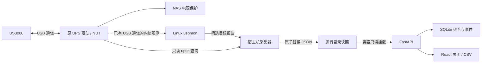

# 架构与数据流

页面、历史记录和设备保护分工独立。原 UPS 驱动继续拥有 USB 接口，本项目只观察它已经产生的通信。

## 部署位置

从 0.3.1 起，默认 Compose 拉取预构建面板镜像，宿主机采集器仍独立运行。源码目录、NAS 部署目录和系统服务目录各有用途：

| 位置 | 内容 | 运行时用途 |
| --- | --- | --- |
| 完整源码目录，可位于开发电脑 | 前端、后端、测试、构建文件 | 开发与构建镜像；NAS 默认部署不需要前端源码或 Node.js |
| NAS 部署目录 | `compose.yaml`、`.env`、安装脚本、`data/` | Compose 配置与持久历史，目录应放在 NAS 持久存储中 |
| `/opt/ugreen-ups-panel/current` | 已安装的采集器版本 | systemd 运行宿主机采集器 |
| `/etc/ugreen-ups-panel.env` | 序列号、NUT 目标、校准配置 | 宿主机采集器配置，独立于 Compose `.env` |
| `/run/ugreen-ups-panel/latest.json` | 最新采集快照 | 容器只读读取；不是历史数据库 |
| 部署目录下的 `data/history.sqlite` | SQLite 历史数据库 | 默认以 `./data` 绑定到容器 `/data` |

Docker Desktop 可在开发电脑上构建面板镜像，但这不等于该电脑可以采集 NAS 的 USB 数据。真实采集器需要运行在连接 UPS、具备 Linux usbmon 和原 UPS 驱动的宿主机。容器通过快照文件读取数据，不通过网络自动寻找另一台 NAS。

## 宿主机采集器

`collector.py` 与 `usbmon.py` 仅依赖 Python 标准库和 Linux 接口。设备发现依据 sysfs 中的 VID/PID、USB 总线、地址与可选序列号；定期重新发现，地址变化后重建读取器。多设备匹配不明确时不擅自挑选。

采集器使用 usbmon 的二进制字符设备。它不调用 HID 写入，不解绑内核/用户态驱动，不向 UPS 下发控制命令；系统安装时加载 usbmon 模块并启用本项目的 systemd 服务。usbmon 会增加少量采集与复制开销，不能宣称绝对零系统影响。默认服务包含 CPU、内存、文件系统和权限限制。

原驱动没有发起相应请求时，被动采集无法创造缺失报告。因此项目不会通过暂停 NUT 来提高兼容性。

## 快照与估算

`protocol.py` 负责完整报告解析、字段有效性、未知模式与候选量；`power.py` 负责显式选择的经验模型。每份新报告进入模型一次，缺失或不适用值保留为空。

快照写入临时文件，再以原子重命名替换 `latest.json`，避免页面读到半份 JSON。快照包括最新样本、来源、心跳、受限的 NUT 状态和诊断计数。快照是当前状态，不是原始数据档案。

样本时间与心跳分别检查。读不到文件、格式无效或超过新鲜度窗口时，API 将其标记为不可用；页面不把最后一次有效数字伪装成实时值。

## Web 与历史

FastAPI 同时提供本地静态资源与只读 API。容器没有 USB 设备挂载，也不需要 root；只读挂载快照目录，独占可写的 `/data`。0.3.1 默认将 `/data` 映射到部署目录中的 `./data`，可通过 Compose 环境变量指定其他持久目录。

默认 Compose 项目名固定为 `ugreen-ups-panel`，避免部署目录改名后意外创建另一套服务。数据目录需要预先存在并允许 UID/GID `10001:10001` 写入；Compose 不会静默创建一个归属不正确的空目录。旧版命名卷中的历史不会自动迁移到新绑定目录，升级时应按 README 完成显式迁移并保留原卷。

| 接口 | 用途 |
| --- | --- |
| `GET /api/live` | 当前样本、来源、新鲜度、NUT 与记录状态 |
| `GET /api/health` | 服务可响应状态和采集新鲜度摘要 |
| `GET /api/history?hours=24` | 1–2160 小时范围的聚合历史 |
| `GET /api/events` | 最近的供电和连接事件 |
| `GET /api/export.csv?hours=24` | 与历史查询范围对应的聚合导出 |

历史写入按样本时间去重，使用均值所需的总和、计数及最小/最大值，不长期保存逐帧载荷。不同模式和模型的记录保留独立身份。历史查询只返回已提交数据，可能比实时界面晚一个提交周期。

每个历史点的 `context` 保存校准配置、模型、质量状态、公式及解码器版本，CSV 导出相同身份信息。旧记录没有可信元数据时标为 `legacy_unrecorded`，不会从数值反推一个模型名称。

数据库失败不会阻止实时接口继续读取快照。待写队列最多保留 4096 个桶，溢出时舍弃最早的桶，并通过实时/健康接口的 `storage_dropped_buckets` 报告；这不是无限时长的故障数据补写保证。

**同一数据库只使用一个后端 worker。** SQLite 提供落盘事务，进程内还有待提交桶；多 worker 会重复记录或覆盖状态。容器健康检查不因 USB 暂时离线而反复重启页面，离线应由页面状态表达。

## 信任与网络边界

本项目的页面无账号体系，能够访问 HTTP 服务的人可读取设备遥测、历史和诊断。默认绑定回环地址，接入局域网时由部署者管理网络访问。详细权限与隐私说明见[安全说明](../SECURITY.md)。

硬件档案是静态资料，不能替代本机硬件识别。芯片具备的检测/控制功能也不会自动变成公开 API 字段。
