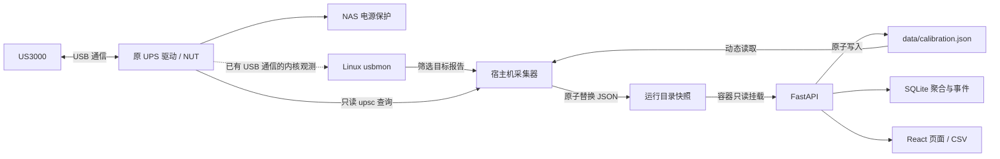

# 架构与数据流

页面、历史记录和设备保护分工独立。原 UPS 驱动继续拥有 USB 接口，本项目只观察它已经产生的通信。

## 部署位置

默认 Compose 拉取 Docker Hub 上的预构建面板镜像，Compose 配置与采集器安装文件直接来自 GitHub 仓库。GitHub Release 用于版本说明，安装不依赖另行制作的部署压缩包。宿主机采集器仍独立运行，源码目录、NAS 部署目录和系统服务目录各有用途：

| 位置 | 内容 | 运行时用途 |
| --- | --- | --- |
| 开发电脑上的独立仓库检出 | 前端、后端、测试、构建文件 | 开发与构建镜像；NAS 默认部署不需要编译源码或安装 Node.js |
| NAS 部署目录 | `docker-compose.yaml` 与 `data/` | 持久保存历史和校准配置；采集器安装完成后，运行不依赖该目录中的源码 |
| `/opt/ugreen-ups-panel/current` | 已安装的采集器版本 | systemd 运行宿主机采集器 |
| `/etc/ugreen-ups-panel.env` | 安装器管理的采集器设置 | 自动生成并保留已有设置，普通安装无需编辑 |
| `/run/ugreen-ups-panel/latest.json` | 最新采集快照 | 容器只读读取；不是历史数据库 |
| 部署目录下的 `data/history.sqlite` | SQLite 历史数据库 | 默认以 `./data` 绑定到容器 `/data` |
| 部署目录下的 `data/calibration.json` | 网页保存的功率校准配置 | 面板原子写入，宿主机采集器动态读取 |

Docker Desktop 可在开发电脑上构建面板镜像，但这不等于该电脑可以采集 NAS 的 USB 数据。真实采集器需要运行在连接 UPS、具备 Linux usbmon 和原 UPS 驱动的宿主机。容器通过快照文件读取数据，不通过网络自动寻找另一台 NAS。

Compose 默认使用 `bsakuramiku/ugreen-ups-panel:latest`，通过 NAS 的 `9086` 端口提供页面，不需要项目 `.env` 文件。**v0.6.0 需要先更新宿主机采集器，再更新面板容器。** 从临时目录安装时通过 `--data-dir` 沿用原数据目录，保留校准文件和历史；源码无需长期留在 NAS 运行目录。仅面板变更的后续版本仍可执行 `docker compose pull && docker compose up -d`，具体以发布说明为准。



## 宿主机采集器

`collector.py` 与 `usbmon.py` 仅依赖 Python 标准库和 Linux 接口。设备发现依据 sysfs 中的 VID/PID、USB 总线、地址与可选序列号；定期重新发现，地址变化后重建读取器。多设备匹配不明确时不擅自挑选。

采集器使用 usbmon 的二进制字符设备。它不调用 HID 写入，不解绑内核/用户态驱动，不向 UPS 下发控制命令；系统安装时加载 usbmon 模块并启用本项目的 systemd 服务。usbmon 会增加少量采集与复制开销，不能宣称绝对零系统影响。默认服务包含 CPU、内存、文件系统和权限限制。

原驱动没有发起相应请求时，被动采集无法创造缺失报告。因此项目不会通过暂停 NUT 来提高兼容性。

## 快照与估算

`protocol.py` 负责完整报告解析、字段有效性、未知模式与候选量；`power.py` 负责显式选择的经验模型。每份新报告进入模型一次，缺失或不适用值保留为空。

校准文件支持 `none`、`local-19v-v1` 与 `custom`，默认 `none`。schema 1 保留原有结构、内容哈希和 18–20 V 输入规则。schema 2 只用于 `custom`，新增 `ac_voltage_nominal_v`（12、19 或 20）；`coefficients.base_gain` 必填，`charge_gain`、`battery_gain` 可为 `null`。新版自定义交流估算按适配器输入与标称值相差不超过 1 V 判断适用性；缺少系数的计算分支不提供估算。

`revision` 由规范化的完整配置派生，包括新版标称电压；相同配置重复保存不会生成新版本。新自定义模型标识不再固定为 19 V。电压进入历史的校准身份，旧记录和原始量不重写。采集器通过 `--calibration-config` 或 `UPS_CALIBRATION_CONFIG` 读取文件；合法文件优先于 `UPS_CALIBRATION_PROFILE`，没有文件时使用原有配置，非法文件保留最后有效配置并报告错误。安装器负责连接实际数据目录与采集器设置。

分步助手只读适配器输入和相关原始字段，不使用 UPS 输出电压推断适配器标称值。在线未充电窗口以 `W / mean(B)` 求基底；充电窗口以 `(W − a × mean(B)) / mean(C)` 求回充补偿，采用本充电窗口的均值。每窗 30 秒、至少 12 个去重样本，相关原值的 `(max−min)/mean` 超过 10% 或采集不连续时重采，`mean(C)<2 W` 不求回充系数。完成窗口冻结，用户手工输入同期交流瓦数；助手不调用 HA 或任何供电控制接口。详细规则见[校准说明](calibration.md)。

面板保存成功仅说明配置已经落盘。生效状态还要检查新鲜采集快照是否报告相同的校准版本；旧采集器、断连或过期快照都不能确认生效。配置变更后重新建立 8 秒估算窗口，原始字段不受系数影响。`custom` 始终未独立验证，输入上限不代表精度或适用范围。

快照写入临时文件，再以原子重命名替换 `latest.json`，避免页面读到半份 JSON。快照包括最新样本、来源、心跳、受限的 NUT 状态和诊断计数。快照是当前状态，不是原始数据档案。

样本时间与心跳分别检查。读不到文件、格式无效或超过新鲜度窗口时，API 将其标记为不可用；页面不把最后一次有效数字伪装成实时值。

## Web 与历史

FastAPI 同时提供本地静态资源、遥测读取 API 和校准配置 API。容器只读挂载快照目录，在可写的 `/data` 中保存数据库和校准配置。Compose 将 `/data` 映射到部署目录中的 `./data`；宿主机采集器仅从中读取校准文件。镜像默认用户为 `10001:10001`，仓库 Compose 则以 `user: "0:0"` 兼容部分 NAS 的绑定目录权限。它没有 USB 设备挂载，也没有开启 `privileged`；面板的功能不依赖 root，可按 [非 root 方案](../README.md#non-root)准备权限后使用普通用户运行。

Compose 自动读取 `docker-compose.yaml`。顶层 `name` 是可选参数，默认配置不设置；没有通过 `-p` 或 `COMPOSE_PROJECT_NAME` 指定项目名时，项目名来自部署目录名称，README 的默认部署目录为 `ugreen-ups-panel`。已有部署应保持相同目录名称，或显式沿用原项目名，避免新建另一组容器。采集器安装脚本自动创建项目 `data/`，设置目录 UID/GID `10001:10001` 和权限 `0750`，保留已有数据库与校准配置，不会递归改写已有文件的权限。因此，Docker 项目的实际挂载目录必须与安装时准备的目录一致；从 root 切回普通用户时，还需检查已有数据库、WAL/SHM 和校准文件的所有者。首次安装默认使用源码目录下的 `data/`；从临时源码目录升级时，以 `--data-dir /实际部署路径/data` 明确沿用原数据目录。先运行安装脚本，再启动 Compose。面板直接读取镜像默认的快照与数据库路径，不需要额外的路径环境变量。

| 接口 | 用途 |
| --- | --- |
| `GET /api/live` | 当前样本、来源、新鲜度、NUT 与记录状态 |
| `GET /api/health` | 服务可响应状态和采集新鲜度摘要 |
| `GET /api/calibration` | 已保存配置、采集器实际配置、公式与生效状态 |
| `PUT /api/calibration` | 校验并原子保存所选配置和自定义系数 |
| `GET /api/history?hours=24` | 1–8760 小时（365 天）的聚合历史，包含均值、极值与实际记录跨度 |
| `GET /api/events` | 最近的供电和连接事件 |
| `GET /api/battery-sessions?days=90&limit=50` | 电池供电明细与范围统计；最多 365 天、每次最多返回 500 条 |
| `GET /api/export.csv?hours=24` | 与历史查询范围对应的均值、极值及模型身份导出 |

校准仍使用 `GET/PUT /api/calibration`。新版页面发送 `X-UPS-Calibration-Version: 2`；响应提供 `supported_config_schemas`，采集器快照也声明支持 schema 1、2。新版 `custom` 的 PUT 在原 `profile`、`coefficients`、`expected_revision` 外增加 `ac_voltage_nominal_v`，请求体不传 `schema`。服务端同时检查页面和采集器能力：旧页面不能覆盖 schema 2 配置，会提示刷新；旧采集器需先升级，不能接受新版配置。

### 分层历史

| 统计粒度 | 保留周期 | 用途 |
| --- | --- | --- |
| 10 秒 | 7 天 | 近期细节 |
| 60 秒 | 90 天 | 短期与月度趋势 |
| UTC 日 | 365 天 | 超过 90 天的半年、一年趋势 |

历史写入按样本时间去重，各层保留每个指标的总和、有效计数、最小值和最大值，不长期保存逐帧载荷。跨桶合并时按总和与计数计算均值，避免把样本数量不同的均值再次平均。不同供电模式、模型及 `calibration_revision` 保留独立身份，不把不同系数的样本混算为一个均值。历史查询只返回已提交数据，可能比实时界面晚一个提交周期。

v0.5.0 从数据库中仍保留的 60 秒历史补建日统计，再持续记录新数据。回填以事务和进度记录避免重复累计，沿用原始统计量和模式/校准身份，不将已经删除或从未采集的时段补成数据。日界线使用 UTC；当天的日统计只包含截至当前已提交的样本。

页面支持 1 小时、24 小时、7 天、30 天、90 天、180 天及 365 天。横轴始终覆盖所选时间范围，另行显示实际有记录的日期跨度；无记录和中断时段留空。电芯压差同时显示均值和已记录样本中的峰值；这里的峰值不代表采集间隔内未记录到的瞬时最大值。

每个历史点的 `context` 保存校准配置、精确系数、`calibration_revision`、模型、质量状态、公式及解码器版本，CSV 导出相同身份信息。修改校准只影响后续估算，不重算已有历史。旧记录没有可信元数据时标为 `legacy_unrecorded`，不会从数值反推一个模型名称。

查询返回 `requested_start/end`（请求范围）和 `available_start/end`（返回记录的实际首末时间）；有首末记录不代表中间连续无缺口。每个点的 `first/last` 是真实样本首末，`bucket_start/end` 是统计桶边界。半年/一年查询返回与范围相交的完整 UTC 日桶；边缘桶以 `partial_range` 标记，日均值与峰值仍是整桶统计，无法精确裁成半日；因此最早记录可能比请求起点早不到一天。CSV 保留均值列，追加各指标和电芯的 `_min`、`_max` 列，以及这些时间与边界字段。

### 电池供电记录

电池供电明细从升级后第一个有效样本开始记录，不从旧状态事件或聚合历史反推每次供电的起止和电量。原状态事件仍保留。明细使用新鲜样本的时间和 SOC；重复、倒序样本不增加次数。

观察到外部供电切入 `battery`，再切回 `online` 或 `charging`，且中途没有采集缺口，才是完整记录。首次样本已经处于电池模式、采集离线、超过 10 秒的样本缺口或 `unknown` 模式，都标为不完整；未观察到的时间不补算。短暂面板重启可续接仍连续的观测，进行中记录仅累计到最新有效样本，不随浏览器时钟持续增长。

每条记录显示起止、观测时长、起止 SOC 和电量净下降。净下降按“起始 SOC − 结束 SOC”计算，单位为百分点；反弹产生的负数照实保留，不累计每次向下跳变，也不换算为 Wh 或电池循环次数。

查询默认 90 天，可选 7、30、90、180、365 天。跨边界记录保留自己的起止，统计按以下口径计算：

- 次数只数开始时间落在窗口内、且已确认观察到开始的供电记录。
- 观测时长按查询窗口裁剪，缺测时段不计入。
- 总电量净下降只汇总完整、起止全部落在窗口内且 SOC 齐全的记录。缺少边界电量时不按时长比例分摊。

`GET /api/battery-sessions` 返回 `recording_since`、`capture_fresh`、`summary`、`records`、`total_records` 和 `has_more`，分别用于说明开始记录的时间、采集新鲜度、范围统计、明细及列表是否还有更多记录。

数据库失败不会阻止实时接口继续读取快照。待写队列最多保留 4096 个桶，溢出时舍弃最早的桶，并通过实时/健康接口的 `storage_dropped_buckets` 报告；这不是无限时长的故障数据补写保证。

**同一数据库只使用一个后端 worker。** SQLite 提供落盘事务，进程内还有待提交桶；多 worker 会重复记录或覆盖状态。容器健康检查不因 USB 暂时离线而反复重启页面，离线应由页面状态表达。

## 信任与网络边界

本项目的页面无账号体系，能够访问 HTTP 服务的人可读取设备遥测、历史和诊断，也可修改后续功率估算使用的校准配置。校准 API 不提供 UPS 控制、关机策略或系统服务管理。默认使用 NAS 的 `9086` 端口，适用于可信局域网。详细权限与隐私说明见[安全说明](../SECURITY.md)。

硬件档案是静态资料，不能替代本机硬件识别。芯片具备的检测/控制功能也不会自动变成公开 API 字段。

## 备份与维护

历史保存在项目 `data/history.sqlite`，校准保存在 `data/calibration.json`；更新或重建容器不会删除它们。已有校准文件时，备份时一并复制该文件。历史数据库的在线备份使用 SQLite 备份接口，避免遗漏尚在 WAL 文件中的已提交记录：

```sh
(
  set -eu
  ups_panel_backup_path="$(docker compose exec -T panel python -c "import os, sqlite3, tempfile; s=sqlite3.connect('file:/data/history.sqlite?mode=ro', uri=True); fd, p=tempfile.mkstemp(prefix='ups-panel-backup-', suffix='.sqlite', dir='/tmp'); os.close(fd); d=sqlite3.connect(p); s.backup(d); d.close(); s.close(); print(p)")"
  docker compose cp "panel:$ups_panel_backup_path" ./
  docker compose exec -T panel rm -- "$ups_panel_backup_path"
)
```

备份复制到当前目录中的独立 `ups-panel-backup-*.sqlite` 文件。容器内临时文件位于 `/tmp`，成功复制后删除，避免在 `data` 内留下切换用户后无法覆盖的固定备份文件。上述命令也应沿用原 Compose 项目名。

恢复备份时先停止 `panel`，保留当前数据库副本，再替换 `data/history.sqlite`，移走对应旧 WAL/SHM 文件并确认目录与数据库允许所选容器用户写入后启动。使用非 root 方案时，目录和相关文件应属于 `10001:10001`。不同版本间恢复前需核对数据库兼容性，不能在面板仍写入时替换数据库。

回滚到旧采集器时，schema 2 校准文件也需要恢复为适用的兼容 schema 1 配置或 `none`。先备份当前配置，再按[校准回滚说明](calibration.md#升级与回滚)处理；保留已有历史，不通过删除数据库解决配置版本问题。

卸载使用 `docker compose down` 和 `sudo sh scripts/uninstall-collector.sh`。这两步保留历史数据，采集器卸载脚本不管理原 UPS/NUT 服务。
